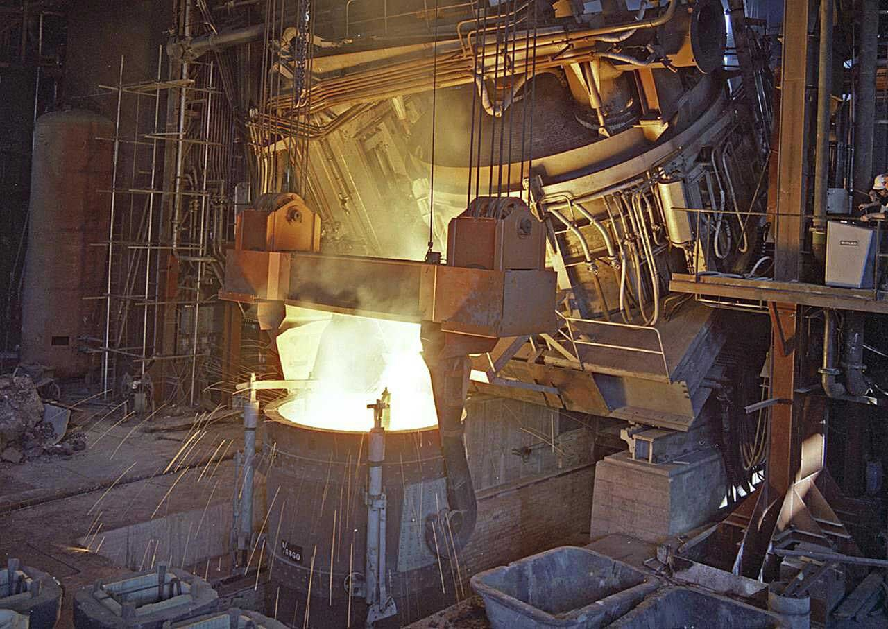

## **Отчет**

### **Введение**

В данном отчете представленны результаты работ разработке по прототипа модели машинного обучения для задачи предсказания температуры выпуска стали при ее плавлении в дуговой сталеплавильной печи. В отчете представлен обзор данных исплоьзованных для создания модели, план и ход работ, результаты работ, выводы и рекомендации основанные на полученном результате.

#### **Тема работы**

**Промышленность — задача проекта**\
Чтобы оптимизировать производственные расходы, металлургический комбинат ООО «Так закаляем сталь» решил уменьшить потребление электроэнергии на этапе обработки стали. Вам предстоит построить модель, которая предскажет температуру стали

Сталь обрабатывают в металлическом ковше вместимостью около 100 тонн. Чтобы ковш выдерживал высокие температуры, изнутри его облицовывают огнеупорным кирпичом. Расплавленную сталь заливают в ковш и подогревают до нужной температуры графитовыми электродами. Они установлены в крышке ковша. 

Из сплава выводится сера (десульфурация), добавлением примесей корректируется химический состав и отбираются пробы. Сталь легируют — изменяют её состав — подавая куски сплава из бункера для сыпучих материалов или проволоку через специальный трайб-аппарат (англ. tribe, «масса»).

Перед тем как первый раз ввести легирующие добавки, измеряют температуру стали и производят её химический анализ. Потом температуру на несколько минут повышают, добавляют легирующие материалы и продувают сплав инертным газом. Затем его перемешивают и снова проводят измерения. Такой цикл повторяется до достижения целевого химического состава и оптимальной температуры плавки.

Тогда расплавленная сталь отправляется на доводку металла или поступает в машину непрерывной разливки. Оттуда готовый продукт выходит в виде заготовок-слябов (англ. *slab*, «плита»).

#### **Проблематика работы**

В работе предстоит решить проблему определения температуры выпуска готовой стали из ковша. Единицей моделирования в работе является ковш или партия. Ковш(партия) имеет начальные параметр температуры и конечный(целевой) параметр температуры, данные об операциях в цикле (добавление легирующих добавок(сыпучих материалов или проволоки), продувание инертным газом.

### **Данные**

#### **Состав данных**

Полученные данные представленны 7 датафреймами:  данные об электродах, данные о подаче сыпучих материалов (объём), данные о подаче сыпучих материалов (время), данные о продувке сплава газом, результаты измерения температуры, данные о проволочных материалах (объём), данные о проволочных материалах (время)

#### **Содержание данных**

Каждый набор данных содержит ключ с номером партии к которому относятся данные.\
Всего предоставленно данных о партиях с номерами 1 до 3241. В данном наборе представленные не все номера партий.

Содержание данных в датафреймах:
1. Данные об электродах - активня и реактивня энергии каждого нагрева и время начала и окончания нагрева
1. Данные о подаче сыпучих материалов (объём) - объем добавленного типа материала, всего 15 видов материалов для 1 партии
1. Данные о подаче сыпучих материалов (время) - время добавления типа материала для 1 партии
1. Данные о продувке сплава газом - объеме использованного газа 1 партии
1. Результаты измерения температуры - начальная, конечная и промежуточные температуры для 1 партии, время замера температуры  
1. Данные о проволочных материалах (объём) - объем добавленного типа проволоки, всего 9 видов материалов для 1 партии
1. Данные о проволочных материалах (время) - время добавления типа проволоки для 1 партии

#### **Обзор данных**

По каждому набору данных был выполнен обзор - выведена и проанализирована основная информаци, рассмотрены несколько первых значений, составлены графики распределения и диаграммы размаха

Все признаки являются численными

Анализ данных показал что данные содержат выбросы, аномальные значения и пропуски

### **План решения задачи**

Исходя из анализа полученных данных и цели работы был составлен план работы содержащий следующие пункты:

1. Предобработка данных:

    1. Удаление партий с явно авномальными значениями 
    1. Заполнение пропусков в таблицах подачи проволочных и сыпучих материалов нулевым значением
    1. Генерация новых признаков
    1. Агрегирование по ключу значений мощности(суммарное значения активной и суммарное значение реактивной мощности для партии)
    1. Агрегирование начальной температуры и конечной температуры

1. Объединение в один датафрейм по номеру партии(ключу)
    1. Отбор только партий с данными о температуре
    1. Где измерение температуры первая и последняя операция цикле

1. Исследование объединенного датафрейма
    1. Исследование зависмости признаков и целевой переменной
    1. Построение хитмап
    1. Предобработка полученного датафрема
    
1. Выбор модели
    1. Выделение тестовой выборки
    1. Получение метрики на кросс-валидации и подбор гиперпараметров
    1. Выбор модели с лучшей метрикой

1. Получение результа
    1. Получение результата на тестовой выборке
    1. Исследование важности признаков
    1. Общий выводы 

### **Ход решения задачи**

#### **Предобработка данных**

**Предобработка исходных данных**\
На этапе предобработки данных отдельных датафремах были выполнены следующие действия:
1. Созданы признаки:
    1. Времения нагрева шихты электродами - сумма разностей времени начала и конца нагревов для одного цикла
    1. Полной мощности $S = \sqrt{P^2 + Q^2}$ - полная мощность, где P - активная мощность, Q - реактивная мощность
    1. Признак характеризующий добавленные типы материалов и проволоки (не использовался для обучения модели)
    
    
2. Удалены данные об содержащие аномальные значения реактивной мощности (-715) и температуры (>1350)
3. Данные о температуре были объеденины по номеру партии и оставлены значения начальной и конечной температуры
4. Пропуски в датафреймах о сыпучих и проволочных материалах были заполнены 0, покольку пропуск означал что материал не подавался в этой партии
4. Составлены датафреймы содержащие информацию о времени последней оперции в цикле
5. Все датафреймы были проиндексированы по ключу партии

**Объединение данных**\
Далее все датафреймы были объеденины в один по номеру партии, в итоговый датафрейм вошли только партии представленные в каждом наборе данных.

Проведена конечная проверка что замеры температур являются первой и последней операцией в цикле, после чего данные о времени были удалены.

**Итоговый датафрейм**\
В итоговый датафрем вошел 31 признак и данные о 2324 партиях

Анализ хитмап показал что в данных присутствуют коллинеарные признаки (корреляция равна 1): 1 - это энергия на электродах (active_power, reactive_power, sum_power), 2 - обьемы материала Bulk 9 и проволоки Wire 8. 

Основной причиной удаления партий стало отсутствие данных о температуре в партиях после 2499, ни одна более 700 партии после этого номера не вошли в конечный набор данных, это свидетельствует об ошибке на этапе сбора данных

#### **Разработка модели**

**Подготовка признаков**\
Для обучения модели был выделен целевой признак, признаки были разделены на тренировочну и тестовую выборки в соотношении 1:3, признаки были масштабированы SatndardScaler

**Выбор модели**\
Для тестирования выбраны три модели:
1. Линейная регрессия
1. Случайный лес
1. LightGBM

**Кроссвалидация и подбор гиперпараметров**
1. Линейная регрессия
    1. Для обучения линейной регрессия из выборки были удалены коллинеарные признаки
    1. Для кросс валидации использовались следующие параметры: cv=5, scoring='neg_mean_absolute_error'
    1. Полученный результат МАЕ = 6.77
    
    
1. Случайный лес
    1. Подбор гиперпараметров и кросс-валидация осуществлялась с использованием GridSearchCV, 
    1. Подбирались следующие гиперпараметры: 'n_estimators': [500, 700, 1000], 'max_depth': [1, 5, 10], 'min_samples_split': [2, 3, 5]
    1. Для кросс валидации использовались следующие параметры: cv=5, scoring='neg_mean_absolute_error'
    1. Полученный результат MAE = 6.36
    
    
1. LightGBM
    1. Подбор гиперпараметров и кросс-валидация осуществлялась с использованием GridSearchCV, 
    1. Подбирались следующие гиперпараметры:     'num_leaves': [7, 14, 21, 28, 31, 50], 'learning_rate': [0.1, 0.03, 0.003], 'max_depth': [-1, 3, 5], 'n_estimators': [50, 100, 200, 500]
    1. Для кросс валидации использовались следующие параметры: cv=5, scoring='neg_mean_absolute_error'
    1. Полученный результат MAE = 6.27 
    1. Модель выбрана для проверке на тестовой выборке

**Проверка модели**\
Проверка на тестовой выборке проводилсаь на модели LightGBM с гиперпараметрами определенными на с помощью GridSearchCV на кросс-валидации.\
Значение метрики на тестовой выборке MAE = 5.99 меньше требуемой 6.8 - модель работает успешно

**Оценка важности признаков**

1. Наиболее важными признаками для предсказания температуры выпуска стали из ковша являются начальная температура(temp_first) и суммарная продолжительность нагрева электродами (heating_duration) - оценка важности > 800, следующие по важности объем газа для перемешивания плавки(gas) и объем проволки 1 (Wire 1) > 500
1. Признаки характеризующие энергию имеют значимость ниже 300
1. Признаки некоторых добавок имеют почти нулевую значимость

Для разделения признаков и моделей Случайного леса и LightGBM использовался указанный в задании random_state=20623

### **Результат работ**

По итогу выполнения работы была разработана модель машинного обучения для предсказания температуры выпуска стали при ее плавлении в дуговой сталеплавильной печи. Целевая метрика МАЕ = 5.99 на тестовой выборке получена ниже заданной 6.8 - модель работет успешно

**Данные**\
Для предсказания был составлен общий датафрейм с данными для каждой партии

Рекомендации: Проверить этап сбора данных о температуре стали после 2499 партии

**Признаки**\
Для обучения модели модели LightGBM использовались следующие признаки:\
'temp_first' - начальная температура\
'active_power' - активная энергия при нагреве электродов\
'reactive_power' - реактивная энергия при нагреве электродов\
'heating_duration' - время нагрева электродов\
'sum_power' - полная энергия при нагреве электродов\
'Bulk 1', 'Bulk 2', 'Bulk 3', 'Bulk 4', 'Bulk 5', 'Bulk 6', 'Bulk 7', 'Bulk 8', 'Bulk 9', 'Bulk 10', 'Bulk 11', 'Bulk 12', 'Bulk 13', 'Bulk 14', 'Bulk 15' - объемы сыпучих материалов\
'Wire 1', 'Wire 2', 'Wire 3', 'Wire 4', 'Wire 5', 'Wire 6', 'Wire 7', 'Wire 8', 'Wire 9' - объемы проволочных материалов\
'gas' - объем инертного газа

Признаки 'heating_duration' и 'sum_power' созданы в ходе этой работы.\
Признаки имеющие наибольшую значимость при обучении модели начальная температура и время нагрева

Рекомендации: 
1. Рассмотреть результаты обучения моделей с другим соотношением добавок, некоторые добваки встречаются в малом числе партий, их влияние на целевую переменную может быть оценено неверно
1. Оценить влияние других признаков, например: химический состав входной шихы/руды, продолжительность продувки газом, рабочую бригаду и тд.

**Модель**\
По оценке на кросс-валидации была выбрна модель LightGBM со следующими гиперпараметрами: 'learning_rate': 0.03, 'max_depth': -1, 'n_estimators': 200, 'num_leaves': 28.

Рекомендации: 
1. Оценить качество на других моделях градиентного бустинга
